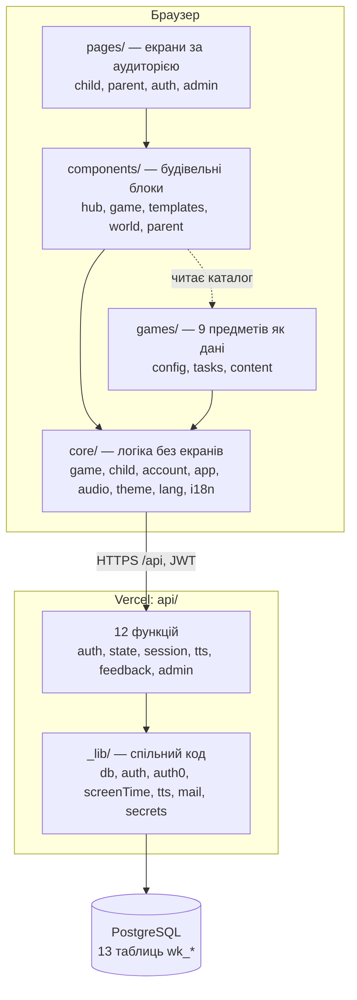
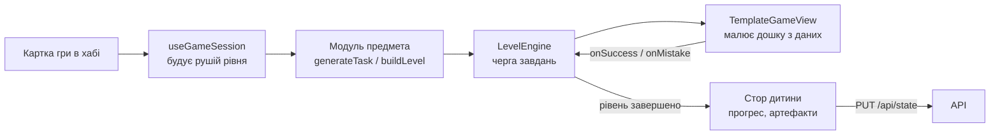
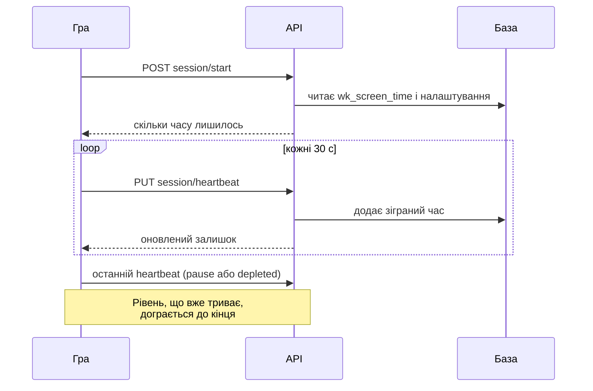
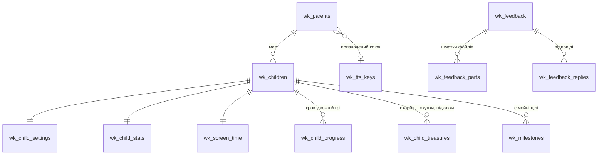

# Pulsar Kids: архітектура застосунку

Станом на 2026-10-09.

Цей документ — огляд для людей: з чого складається застосунок і як частини пов'язані. Подробиці, правила й винятки записані в [`../CLAUDE.md`](../CLAUDE.md); зовнішні сервіси, домен і пошта — в [`external-services.md`](external-services.md). Тут вони не повторюються.

## Коротко

Pulsar Kids (кодова назва WonderKids) — навчальний ігровий майданчик для дітей 3–10 років, зроблений для телефона. У репозиторії два проєкти, які деплояться окремо: **гра** (`game/` — застосунок на Vite + React 18 + TypeScript і 12 серверних функцій Vercel поверх PostgreSQL) і **публічний сайт** (`site/` — статичні сторінки без фреймворка). Спільне для обох лежить у `packages/`. Усе нижче — про гру, якщо не сказано інше; шляхи `src/…`, `api/…` — усередині `game/`.

Чотири рішення визначають усю архітектуру:

1. **Предмет — це плагін, гра — це дані.** Жоден предмет не має власних екранів: усі ігри грають на спільних шаблонах.
2. **Сервер — джерело правди.** Прогрес, налаштування й екранний час зберігаються в базі; у браузері лишається тільки сесія входу.
3. **Сайт і гра — окремі деплої.** Сайт живе на кореневому домені й нічого не знає про гру, крім її адрес. Гра — один деплой із двома обличчями: дитячий хаб (`play.`) і кабінет батьків (`parents.`) — той самий код, обличчя обирається за іменем хоста.
4. **Zero-aggression.** Немає програшу, видимих таймерів і слова «неправильно». Це продуктовий інваріант, який закладено в рушій, а не в окремі ігри.

## Шари

Залежності йдуть лише вниз: `core/` нічого не знає про конкретні предмети, а ігри ніколи не торкаються стора — вони лише повертають завдання.

## Фронтенд

### Структура `src/`

| Папка | Що там | Приклад |
| --- | --- | --- |
| `games/` | По папці на предмет, усі влаштовані однаково: `config.ts` (картки каталогу), `tasks.ts` (генератори завдань), `content/` (прапори, числа, ідентифікатори — без слів), `grammar/` (як із слів `locales` скласти речення кожною з трьох мов) | `games/geography` |
| `games/shared/` | Набір для ігор на шаблонах: `defineSubject(SUBJECT, GAMES, TASKS)` | `templateModule.ts` |
| `core/game/` | Контракти ядра, рушій рівня, типи шаблонів, перевірка відповідей | `engine/LevelEngine.ts` |
| `core/child/` | Стор дитини, прогрес, світ, ігровий час | `store/useGameStore.ts` |
| `core/account/` | Клієнт API, вхід, синхронізація | `sync/useRemoteSync` |
| `core/app/` | Вибір порталу за хостом, SEO, джерела переходів | `portal.ts` |
| `core/audio/` | Синтезатор звуків і голос | `voice.ts` |
| `core/language/`, `core/translator/` | Граматика (відмінки, числівники) і переклад інтерфейсу | `core/language/uk`, `locales/app/uk/common.json` |
| `core/theme/` | Теми: палітра, маскот, артефакт, скарби | `themes.ts` |
| `components/templates/` | 14 спільних ігрових дощок | `GridChoiceLayout.tsx` |
| `pages/` | Екрани маршрутів | `child/HubPage.tsx` |

### Предмети та ігри

Предметів дев'ять: математика, географія, екологія, історія, мова, логіка, астрономія, мистецтво, природа. У хабі вони називаються «галактиками» (`core/game/galaxies.ts`); десята, музика, поки що «скоро».

Предмет реєструє себе в `moduleRegistry` під час імпорту (`src/games/index.ts` підключається з `main.tsx`). Щоб додати предмет, достатньо нової папки й одного рядка імпорту — ядро, хаб і ігрова оболонка не змінюються.

Ігри бувають двох видів:

- **`path`** — драбина кроків, кожен наступний складніший. Рівень складається з п'яти нових завдань і п'яти повторених із попередніх кроків.
- **`free`** — вільна гра без зростання складності: увесь вміст одразу в пулі, грати можна без обмежень.

Батьки можуть сховати будь-яку гру для конкретної дитини (`settings.hiddenGames`): хаб її не показує, а її адреса відповідає «не знайдено».

### Як проходить один рівень

Рушій (`core/game/engine`) володіє чергою завдань одного рівня і тримає правила, спільні для всіх ігор:

- завдання з помилкою ставиться в кінець черги ще раз і втретє не показується;
- три й більше хибних натискань на одному завданні (вгадування) додають нове завдання;
- підказку викликають лише помилки: дві на завданні або одна на повторі;
- однакові завдання відсіюються за `task.key`, тож рівень сам коротшає, коли унікальних завдань мало.

Дошка — це шаблон із `components/templates/`: вибір із сітки, перетягування пар, послідовність, карта, терези, сортування, каса, танграм, лабіринт чисел, бульбашки, з'єднай зірки, змішування кольорів, сітка літер, площа на сітці. Шаблон отримує декларативний опис завдання (`TemplatePayload`) і сам знає, як показати підказку.

### Стан і синхронізація

Увесь стан дитини тримає один стор Zustand (`core/child/store/useGameStore.ts`). Обліковий запис батьків містить кількох дітей; поля активної дитини віддзеркалені в корені стора, щоб компоненти читали `s.settings` напряму.

1. Після входу `useRemoteSync` завантажує стан через `GET /api/state`; до того застосунок показує заставку.
2. Кожна зміна стора зберігається через `PUT /api/state` із затримкою 700 мс.
3. Кабінет батьків призупиняє автозбереження і зберігає за явною кнопкою.

Багато похідних речей не зберігаються окремо, а обчислюються: баланс артефактів (зароблено мінус витрачено), ключі знань, відкрита планета, мешканці світу. Покупки у світі записані як ключі в масиві `treasures`, тому нові можливості не потребують змін у схемі бази.

### Світ дитини

«Мій світ» — сонячна система з восьми планет, якими дитина рухається від Нептуна до Сонця. На кожній планеті за артефакти будують десять будівель і вісім прикрас, а за ключі знань відкривають десять станцій. Правила — чисті функції в `core/child/world/world.ts`, покриті тестами; глобус намальовано власною математикою без 3D-бібліотек.

### Голос

Усе мовлення йде через один вхід — `voice` (`core/audio/voice.ts`). Він має два рівні: природний голос Google Cloud через наш `POST /api/tts` (по голосу на кожну мову) і голос браузера як запасний. Перед озвученням фраза проходить через модуль своєї мови в `core/language/<мова>/`, який перетворює цифри на слова у правильному роді й відмінку («2 машинки» → «дві машинки»).

### Мови

Застосунок працює українською, англійською та польською. Мова не глобальна — їх три, для трьох аудиторій:

| Що | Де зберігається | Хто обирає |
| --- | --- | --- |
| Мова гри дитини | `settings.gameLang`, окремо для кожної дитини | Батьки в кабінеті («Мови») |
| Мова голосу | `settings.voiceLang`, окремо для кожної дитини | Батьки; може відрізнятися від мови на екрані |
| Мова кабінету батьків | `parentLang`, на обліковий запис | Батьки |
| Мова пристрою (сторінки входу, поки нічого не обрано) | cookie `pk_lang` на кореневому домені та `localStorage` | Відвідувач; інакше пропонується мова країни, потім мова браузера, потім англійська |

Де лежать тексти:

- **Усі тексти — у JSON-файлах своєї мови**, `src/locales/app/<мова>/`: `common.json` (інтерфейс), `games/<предмет>.json` (по файлу на гру), `world.json` («Мій світ»). У `.ts`-файлах текстів немає — лише граматика, яка бере слова з JSON.
- **Інтерфейс** — `src/locales/app/<мова>/common.json`; компоненти не містять текстів, а просять їх за ключем (`useT()`). Ключа, якого немає в українському файлі, код не скомпілює; `tests/i18n.test.ts` падає, коли в якійсь мові бракує ключа.
- **Публічний сайт** — власний словник `site/src/locales/<мова>.json` і власний перелік мов (`site/src/languages.ts`); із грою його єднає лише рушій перекладів `@pulsar/i18n`.
- **Ігри** — слова в `src/locales/app/<мова>/games/<предмет>.json`; `games/<предмет>/grammar/{uk,en,pl}.ts` складає з них речення (`J.ключ`, `fill(J.ключ, { … })`). Генератор тримає числа й дошки і жодних слів; речення беруться з текстів предмета потрібною мовою.
- **Граматика** — `core/language/<мова>/`: відмінки, числівники, назви літер.

Гра сама каже, якими мовами вона написана (`SubCategory.langs`), і хаб показує дитині лише ігри її мови — неперекладеної гри там просто немає.

Голос може говорити іншою мовою, ніж показує екран (наприклад, екран англійською, голос українською). Для цього оболонка створює кожне завдання двічі з тим самим зерном випадковості: мовою екрана і мовою голосу. Тому генератор не може дозволяти словам щось вирішувати — обидва створення мають дати те саме завдання.

### Теми

Тема — це глибока «шкірка»: палітра, маскот, мета, артефакт, скарби. Вигляд описано в `themes.ts`, а слова теми беруться зі словника потрібною мовою. `ThemeProvider` записує палітру в CSS-змінні на `:root`, а компоненти читають лише їх. Теми `lego` і `minecraft` змінюють ще й форму: радіуси, тіні, шрифт.

### Портали

| Хост | Портал | Що доступно |
| --- | --- | --- |
| `pulsarkids.com` | `site` | Статична посадкова трьома мовами (`/`, `/en/`, `/pl/`); шляхи застосунку перенаправляються на піддомени |
| `play.pulsarkids.com` | `kid` | Хаб, гра, світ, скарбниця; маршрутів батьків немає |
| `parents.pulsarkids.com` | `parent` | Кабінет батьків і адмінка |
| localhost, LAN, `*.vercel.app` | `dev` | Усе на одному origin |

Портал обирає `core/app/portal.ts`, а `App.tsx` монтує маршрути залежно від нього. Будь-яку зміну маршрутів треба перевіряти на всіх чотирьох.

## Бекенд

### API

`api/*.js` — серверні функції Vercel і єдина реалізація API. Файли й папки з префіксом `_` — спільний код, не маршрути. Локально окремого бекенду немає: плагін Vite `dev-api.ts` віддає ті самі обробники в тому ж процесі.

| Група | Ендпоінти | Хто викликає |
| --- | --- | --- |
| Вхід | `POST /api/auth/login`, `POST /api/auth/child-login`, `GET /api/nickname` | Батьки (Auth0 або пошта), діти (нікнейм + PIN) |
| Стан | `GET /api/state`, `PUT /api/state` | Застосунок після входу |
| Ігровий час | `POST /api/v1/session/start`, `PUT …/heartbeat`, `POST …/reset` | Гра; `reset` — лише батьки |
| Голос | `POST /api/tts` | Рушій мовлення |
| Листи | `/api/feedback` (`POST`, `PUT` — публічні) | Форма на посадковій, адмінка |
| Адмінка | `/api/admin/users`, `/api/admin/speech` | Адмінка, ключ `x-admin-key` |
| Перевірка та країна | `GET /api/health` → `{ ok, country }` | Моніторинг; застосунок — щоб запропонувати мову країни |

Обидва види входу дають власний JWT, суб'єкт якого — id облікового запису батьків; токен дитини додатково несе `childId`.

### Ігровий час

Бюджет часу веде сервер, клієнт лише показує його.

Правила — чисті функції в `api/_lib/screenTime.js`: зміна доби в часовому поясі дитини, перерва понад 90 с вважається паузою, відпочинок поступово повертає час сесії, денний ліміт зупиняє гру до місцевої півночі. `PUT /api/state` ніколи не пише в таблицю ігрового часу.

### Дані

Клієнт надсилає стан одним JSON-об'єктом, а `api/_lib/db.js` розкладає його по нормалізованих таблицях (`saveState`) і збирає назад (`getState`).

Окремо стоїть `wk_tts_cache` — кеш озвучених фраз за хешем. Мови зберігаються в `wk_parents.lang` (кабінет) і `wk_child_settings.game_lang` / `voice_lang` (дитина); приховані ігри — у `wk_child_settings.hidden_games`.

Схема створюється ідемпотентно у функції `ensureSchema`; міграцій немає. Тому нове збережене поле зачіпає чотири місця: типи стора і `migrateChild` на клієнті, DDL таблиці, `saveState` і `getState` на сервері.

## Збірка, тести, деплой

| Команда | Що робить |
| --- | --- |
| `npm run dev` | Vite на `localhost:4321` разом з `/api` |
| `npm run build` | `tsc -b && vite build`; це ж і перевірка типів |
| `npm test` | Чиста логіка на Node: рушій, ігровий час, світ, граматика, словники перекладу, пошта, листи |
| `npm run check:content` | Проганяє генератор кожної гри на кожному кроці кожною її мовою й перевіряє кожне завдання |

Деплой — це пуш у `main`, але сайт і гра — два Vercel-проєкти з одного репозиторію (Root Directory `site` і `game`), і кожен збирається лише тоді, коли змінилась його тека або спільні пакети (`ignoreCommand` у його `vercel.json`). `scripts/deploy.sh` питає, що деплоїти, і комітить тільки вибране.

- **Гра** (`game/`): Vercel збирає фронтенд і функції з `game/api`. Хости — `play.` і `parents.`.
- **Сайт** (`site/`): статична сторінка без React, щоб пошуковики бачили справжній вміст. `site/index.html` — шаблон без власних текстів: плагін `site/build/pages.ts` наприкінці збірки робить із нього по сторінці на мову (`/`, `/en/`, `/pl/`), а `site/build/seo.ts` створює `robots.txt` та `sitemap.xml`. Стилі сайту — `site/src/styles`, скрипти — `site/src/scripts`.
- **Спільне** (`packages/`): `@pulsar/i18n` — рушій перекладів без текстів і без переліку мов; `@pulsar/platform` — про що сайт і гра домовились (хости й порти, cookie вибраної мови, джерело відвідувача); `@pulsar/brand` — іконки й кольори нічного неба. Сайт і гра ніколи не імпортують одне з одного.

## Обмеження, які варто знати заздалегідь

- **12 функцій.** Тариф Vercel Hobby дозволяє 12 функцій на деплой, і всі зайняті: нова поведінка додається в наявний ендпоінт або в `_lib/`.
- **Немає міграцій.** Зміна колонки — це явний `ALTER TABLE` в `ensureSchema`.
- **Локальна розробка на продакшн-базі.** `.env.local` вказує на Neon; без `DATABASE_URL` API працює з Docker-базою на порту 54329.
- **`npm run lint` не працює.** ESLint не встановлено; перевірка коду — це `npm run build`.
- **`README.md` застарів.** Він досі описує застосунок як «zero-backend, LocalStorage».

## Куди дивитися далі

| Питання | Документ |
| --- | --- |
| Точні правила рушія, шаблонів, світу, голосу, контенту | [`../CLAUDE.md`](../CLAUDE.md) |
| Зовнішні сервіси, домен, пошта, змінні середовища | [`external-services.md`](external-services.md) |
| Як додати гру | [`game-authoring-guide.md`](game-authoring-guide.md) |
| Як складається рівень і повторення | [`level-design.md`](level-design.md) |
| Світ як сонячна система | [`world-roadmap.md`](world-roadmap.md) |
