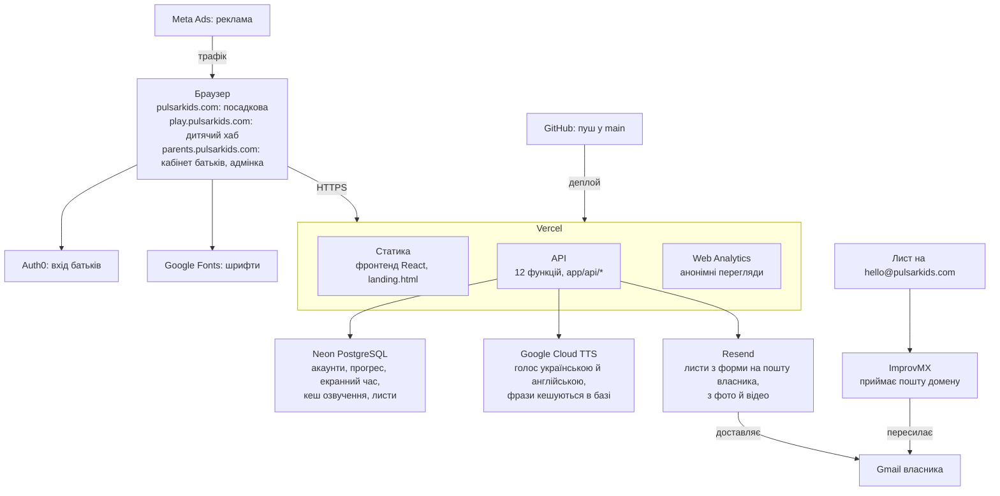

# Pulsar Kids: зовнішні сервіси та інтеграції

Станом на 2026-10-08.

## Огляд

Pulsar Kids (кодова назва WonderKids) працює на дванадцяти зовнішніх сервісах: шість обслуговують застосунок у продакшні, чотири тримають домен і пошту `@pulsarkids.com` (Name.com, Vercel DNS, ImprovMX, Gmail), два (GitHub і Meta Marketing API) потрібні лише для деплою та реклами. Google Search Console підтверджений для домену, але на роботу застосунку не впливає.

Система складається з трьох частин:

- **Фронтенд** — Vite + React 18 + TypeScript (`app/src`), плюс статична посадкова сторінка `app/landing.html`.
- **API** — 12 серверних функцій Vercel у `app/api/*`. Це єдиний бекенд; локально ті самі обробники віддає плагін Vite `dev-api.ts`.
- **Допоміжні скрипти** — окремий репозиторій `scripts/` (запуск, деплой, реклама в Meta).

Один деплой обслуговує чотири «обличчя» за іменем хоста: `pulsarkids.com` (посадкова), `play.pulsarkids.com` (дитячий хаб), `parents.pulsarkids.com` (кабінет батьків та адмінка) і localhost / `*.vercel.app` (усе разом).

Браузер ніколи не звертається до Neon, Google Cloud TTS чи Resend напряму — лише через `/api`. Напряму з браузера йдуть тільки Auth0 (вхід), Vercel Analytics і Google Fonts.

Стрілки показують, хто до кого звертається: браузер бачить лише Vercel, Auth0 і Google Fonts, а решта сервісів схована за API.

## Зведена таблиця

| Сервіс | Категорія | Для чого | Де підключено | Обов'язковий |
| --- | --- | --- | --- | --- |
| Vercel | Хостинг, серверні функції, домени | Віддає фронтенд, виконує `api/*`, тримає домени й редиректи | `app/vercel.json`, `app/api/*` | Так |
| Vercel Web Analytics | Аналітика | Анонімні перегляди сторінок без cookies | `src/main.tsx`, `landing.html` | Ні |
| Neon (PostgreSQL) | База даних | Акаунти, прогрес дітей, екранний час, кеш озвучення, листи | `api/_lib/db.js` | Так |
| Auth0 | Автентифікація | Вхід батьків (пошта + пароль або Google) | `src/pages/auth/Auth0Login.tsx`, `api/_lib/auth0.js` | Ні: без нього вхід лише за адресою пошти |
| Google Cloud Text-to-Speech | Озвучення | Природний голос українською та англійською | `api/tts.js`, `api/_lib/tts.js` | Ні: запасний варіант — голос браузера |
| Resend | Пошта | Пересилає листи з форми «Написати нам» власнику, з вкладеннями | `api/_lib/mail.js`, `api/feedback.js` | Ні: без нього текст зберігається, файли губляться |
| Google Fonts | Шрифти | Baloo 2, Fredoka, Handjet, Press Start 2P | `src/styles/global.css`, `landing.html` | Ні |
| GitHub | Код і запуск деплою | Два репозиторії; пуш у `main` запускає деплой на Vercel | `scripts/deploy-app.sh`, `scripts/autopush.sh` | Так |
| Meta Marketing API | Реклама | Кампанії у Facebook та Instagram | `scripts/ads/meta-ads.mjs` | Ні |
| Name.com | Реєстратор домену | Реєстрація `pulsarkids.com` (з 2026-10-07, до 2027-10-07) | Поза кодом | Так |
| Vercel DNS | DNS | Усі записи домену: сайт, пошта, Auth0, Resend | Поза кодом (панель Vercel → Domains) | Так |
| ImprovMX | Вхідна пошта | Приймає листи на `@pulsarkids.com` (зокрема `hello@`) і пересилає їх далі | Поза кодом (MX-записи домену) | Так, для `hello@` |
| Gmail | Поштова скринька | Сюди приходять переслані листи та листи з форми; звідси власник відповідає | Поза кодом; адреса в `FEEDBACK_TO` | Так, для пошти |
| Google Search Console | SEO | Підтвердження володіння доменом для статистики пошуку | Поза кодом (TXT-запис домену) | Ні |

Поза цим переліком, бо це не зовнішні сервіси: локальний PostgreSQL 16 у Docker (`docker-compose.yml`, порт 54329) для розробки, Web Speech API і Web Audio браузера, а також статичні дані, взяті один раз (портрети з Wikimedia Commons, берегові лінії Natural Earth).

## Сервіси детально

### Vercel: хостинг, API та домени

Vercel — єдина платформа, де виконується застосунок: статика фронтенду і серверні функції з `app/api/*`.

- **Що робить.** Збирає проєкт після кожного пушу в `main`, віддає `dist/`, запускає функції API, зберігає продакшн-змінні середовища.
- **Маршрутизація.** `vercel.json` переписує `/` на `landing.html` на кореневому домені, решту шляхів — на `app.html`; старі хости `*.wonderkids.yluch.app` отримують редирект 308 на `pulsarkids.com`.
- **Індексація.** Особисті шляхи (`/play/*`, `/parent`, `/admin`, `/world`, `/vault`, `/who`) отримують заголовок `X-Robots-Tag: noindex`.
- **Обмеження.** Тариф Hobby дозволяє 12 функцій на деплой, і в `api/` їх рівно 12. Запит приймає до 4,5 МБ, тому форма листів ріже файли на шматки по 1,5 МБ.
- **Домени.** `scripts/setup-vercel-domains.sh` додає `play.` і `parents.` через Vercel CLI.
- **Перевірка.** `curl https://pulsarkids.com/api/health` повертає `{ ok: true }`.

### Vercel Web Analytics

Рахує анонімні перегляди сторінок без cookies; цифри дивитися в панелі Vercel → проєкт → Analytics.

- **У застосунку.** `src/main.tsx` викликає `inject()` з `@vercel/analytics` і перед відправкою відрізає рядок запиту, бо в ньому може бути код входу Auth0.
- **На посадковій.** `landing.html` сама підключає `/_vercel/insights/script.js`.
- **Джерела реєстрацій** рахуються не тут: мітки `utm_*` зберігаються в `wk_parents.signup_*` і показуються в `/admin/sources`.

### Neon: керований PostgreSQL

Neon зберігає весь стан продукту; у браузері лишається лише сесія входу (`wonderkids-auth-v1` у localStorage).

- **Підключення.** `api/_lib/db.js` тримає один пул `pg` (до 3 з'єднань) через pooler-адресу з `DATABASE_URL`; TLS вмикається автоматично для адрес `neon.tech`.
- **Схема.** 13 таблиць `wk_*`, створюються ідемпотентно в `ensureSchema`; міграцій немає, зміна колонки — явний `ALTER TABLE` у тому ж блоці.
- **Що зберігає.** Акаунти й діти (`wk_parents`, `wk_children`, `wk_child_*`, `wk_milestones`), екранний час (`wk_screen_time`), ключі та кеш озвучення (`wk_tts_keys`, `wk_tts_cache`), листи (`wk_feedback`, `wk_feedback_parts`, `wk_feedback_replies`).
- **Локально.** Без `DATABASE_URL` API йде в Docker-базу на порту 54329. Зараз `.env.local` вказує на продакшн-базу Neon.

### Auth0: вхід батьків

Auth0 лише підтверджує, що людина володіє поштовою скринькою; сесію застосунку видає власний API.

- **Потік.** `Auth0Login.tsx` одразу відправляє на Universal Login, після повернення на `/parent-login` міняє ID-токен Auth0 на наш JWT через `POST /api/auth/login { idToken }`.
- **Перевірка на сервері.** `api/_lib/auth0.js` бере ключі з `https://<домен>/.well-known/jwks.json` і перевіряє підпис RS256, видавця й аудиторію; адреса має бути `email_verified`.
- **Домен.** У продакшні це `auth.pulsarkids.com` — власний домен окремого тенанта Pulsar Kids. Токени видаються під цим ім'ям, тому в змінній має стояти саме він, а не `*.auth0.com`.
- **Вихід і пароль.** Вихід закриває і сесію Auth0 (`/v2/logout`); скидання пароля йде на `/dbconnections/change_password`.
- **Налаштування в панелі Auth0.** Кожен origin потребує `<origin>/parent-login` у Allowed Callback URLs, а `https://play.pulsarkids.com/login` — в Allowed Logout URLs.
- **Без Auth0.** Якщо змінні не задані, батьки входять лише за адресою пошти. Діти завжди входять за нікнеймом і PIN, без Auth0.

### Google Cloud Text-to-Speech

Дає природний голос для завдань, підказок і фактів: `uk-UA-Wavenet-A` за замовчуванням, `en-US-Wavenet-F` для англійських карток.

- **Проксі.** Браузер викликає `POST /api/tts`, сервер звертається до `texttospeech.googleapis.com/v1/text:synthesize` і повертає MP3 у base64. Ключ Google ніколи не потрапляє в браузер.
- **Кеш.** Кожна фраза зберігається в `wk_tts_cache` за хешем «голос + швидкість + текст», тож оплачується один раз. Межа — 400 символів на фразу.
- **Ключі.** Не в змінних середовища, а в таблиці `wk_tts_keys`, зашифровані AES-GCM (`api/_lib/secrets.js`). Додаються в `/admin/speech`: один глобальний або окремий на акаунт; `wk_parents.tts_off` вимикає акаунт.
- **Запасний варіант.** Якщо хмара мовчить 3,5 с, немає мережі чи ключ відхилено, говорить Web Speech API браузера.

### Resend: пошта

Пересилає листи з форми «Написати нам» на скриньку власника і надсилає відповіді з `/admin/feedback`.

- **Виклик.** `api/_lib/mail.js` → `POST https://api.resend.com/emails`, тайм-аут 60 с, вкладення в base64.
- **Файли.** Фото й відео ніде не зберігаються: шматки чекають у `wk_feedback_parts`, після відправки листа видаляються, невідправлені чистяться за добу.
- **Відправник.** Домен відправника має бути підтверджений у Resend; до того працює лише `onboarding@resend.dev` і лише на адресу власника акаунта Resend. DNS-записи Resend для `pulsarkids.com` уже додані (MX `send`, DKIM `resend._domainkey`); статус підтвердження видно в панелі Resend → Domains.
- **Куди приходить.** На `FEEDBACK_TO` — напряму, не через `hello@` і не через ImprovMX.
- **Без Resend.** Текст листа зберігається в `wk_feedback`, але нічого не надсилається і вкладення втрачаються.

### Google Fonts

Віддає шрифти напряму в браузер: Baloo 2 і Fredoka всюди, піксельні Handjet і Press Start 2P для тем `lego` / `minecraft`. Підключено через `@import` у `src/styles/global.css` та `<link>` у `landing.html`. Ключів не потребує.

### GitHub

Зберігає код і запускає деплой: пуш у `main` репозиторію `yuriiluchyshyn/wonderkids` підхоплює Vercel.

- **Репозиторії.** `wonderkids` (папка `app/`) і `wonderkids-scripts` (папка `scripts/`). Коренева папка `WonderKids/` не є репозиторієм.
- **Скрипти.** `deploy-app.sh` збирає проєкт, комітить і пушить `app/`; `autopush.sh` — обидва репозиторії. Обидва пушать прямо в `main`.
- **CI.** GitHub Actions немає; єдина перевірка перед деплоєм — локальний `npm run build` у `deploy-app.sh`.

### Meta Marketing API

Створює і веде рекламу у Facebook та Instagram; до застосунку не підключений, працює лише з командного рядка.

- **Скрипт.** `scripts/ads/meta-ads.mjs` звертається до `graph.facebook.com` (версія `v26.0` за замовчуванням). Команди: `check`, `search`, `plan`, `create`, `launch`, `pause`, `stats`.
- **Кампанії.** Описані в `ads/campaigns.json`; усе створюється на паузі, гроші списуються лише після `launch`.
- **Зв'язок із застосунком.** Оголошення ведуть на `pulsarkids.com` з мітками `utm_*`; застосунок зберігає їх при створенні акаунта. Пікселя Meta на сайті немає.

### Пошта домену: ImprovMX і Gmail (`hello@pulsarkids.com`)

Окремої поштової скриньки `hello@pulsarkids.com` не існує: це адреса-псевдонім, листи на яку ImprovMX пересилає в особистий Gmail власника. У коді й змінних середовища цієї адреси немає — усе налаштовано в DNS і в панелях сервісів, тому нижче розділено перевірене і припущення.

Перевірено за DNS-записами домену (2026-10-08):

- **Вхідна пошта.** MX-записи `pulsarkids.com` вказують на `mx1.improvmx.com` (пріоритет 10) і `mx2.improvmx.com` (20). ImprovMX — сервіс пересилання: він не зберігає листи, а передає їх на іншу адресу.
- **SPF.** `v=spf1 include:spf.improvmx.com include:_spf.google.com ~all` — від імені домену дозволено надсилати ImprovMX і серверам Google.
- **DMARC і DKIM Google.** Запису `_dmarc.pulsarkids.com` немає, DKIM-ключа Google для домену теж.

Припущення, які видно лише в панелях (підтвердити в акаунтах):

- **Куди пересилається `hello@`.** Правило задано в панелі ImprovMX (improvmx.com → домен `pulsarkids.com` → Aliases): або окремий псевдонім `hello`, або загальний `*`. Найімовірніше, ціль — той самий Gmail, що стоїть у `FEEDBACK_TO`.
- **Відповіді з `hello@`.** `_spf.google.com` у SPF вказує, що відповіді надсилаються з Gmail через «Надсилати листи як» (Gmail → Налаштування → Облікові записи). Чи це налаштовано і через який SMTP — видно тільки в Gmail.
- **Акаунт ImprovMX.** На яку адресу зареєстрований і який тариф — у коді не записано.

Як пошта проходить:

1. Хтось пише на `hello@pulsarkids.com`.
2. DNS віддає MX-записи ImprovMX, лист приходить туди.
3. ImprovMX пересилає лист у Gmail власника.
4. Власник відповідає з Gmail.

Це окремий шлях від форми «Написати нам»: листи з форми надсилає Resend напряму на `FEEDBACK_TO`, без ImprovMX.

### Домен і DNS: Name.com та Vercel DNS

Домен `pulsarkids.com` зареєстрований у Name.com 2026-10-07 на рік, а його DNS веде Vercel (`ns1.vercel-dns.com`, `ns2.vercel-dns.com`). Так виглядає домен, куплений через Vercel, — тоді він керується й оплачується в панелі Vercel → Domains; це варто підтвердити там.

Усі записи живуть в одній зоні Vercel DNS:

| Запис | Значення | Для якого сервісу |
| --- | --- | --- |
| A / ALIAS кореня, `play`, `parents` | Vercel | Сайт і застосунок |
| MX `@` | `mx1.improvmx.com`, `mx2.improvmx.com` | ImprovMX: вхідна пошта |
| TXT `@` (SPF) | `include:spf.improvmx.com include:_spf.google.com` | ImprovMX і Gmail |
| TXT `@` | `google-site-verification=…` | Google Search Console |
| CNAME `auth` | `…edge.tenants.us.auth0.com` | Auth0: власний домен входу |
| MX `send` | `feedback-smtp.eu-west-1.amazonses.com` | Resend: зворотна адреса (працює поверх Amazon SES) |
| TXT `resend._domainkey` | DKIM-ключ | Resend: підпис листів |

### Google Search Console

TXT-запис `google-site-verification` підтверджує володіння доменом у Google. Він потрібен для Search Console (статистика пошуку, подання `sitemap.xml`, яку створює `seo-plugin.ts`). Коду, що звертається до Google, для цього немає.

## Ключові потоки

### Вхід батьків

1. Браузер на `parents.pulsarkids.com` переходить на Auth0 Universal Login (`auth.pulsarkids.com`).
2. Auth0 повертає на `/parent-login` з ID-токеном.
3. `POST /api/auth/login` перевіряє токен за ключами JWKS і шукає акаунт у Neon за `email_key`.
4. API видає власний JWT (30 днів за замовчуванням); далі Auth0 не бере участі.

### Гра дитини

1. Дитина входить на `play.pulsarkids.com` за нікнеймом і PIN (`POST /api/auth/child-login`).
2. `GET /api/state` завантажує стан із Neon; зміни зберігаються через `PUT /api/state` із затримкою 700 мс.
3. Під час гри `PUT /api/v1/session/heartbeat` кожні 30 с списує екранний час; бюджет веде сервер.

### Озвучення фрази

1. Клієнт надсилає `POST /api/tts { text, lang? }`.
2. API визначає ключ акаунта (`getTtsConfig`) і шукає фразу в `wk_tts_cache`.
3. Якщо фрази немає, API синтезує її в Google Cloud TTS і кладе в кеш.
4. Відповідь 404 `tts_disabled`, помилка або затримка понад 3,5 с перемикають клієнт на голос браузера.

### Лист із сайту

1. Форма на посадковій надсилає текст (`POST /api/feedback`) і файли шматками по 1,5 МБ (`PUT`).
2. Текст лягає в `wk_feedback`, шматки — у `wk_feedback_parts`.
3. Крок `finish` збирає лист, надсилає його через Resend на `FEEDBACK_TO` і видаляє шматки.
4. Власник відповідає з `/admin/feedback`; відповідь зберігається в `wk_feedback_replies`.

### Деплой

1. `./scripts/deploy-app.sh` запускає `npm run build`, комітить і пушить `app/` у GitHub.
2. Vercel підхоплює коміт у `main`, збирає фронтенд і функції.
3. Під час збірки на Vercel `seo-plugin.ts` перейменовує `index.html` на `app.html` і створює `robots.txt` та `sitemap.xml`.

## Конфігурація та секрети

Продакшн-значення зберігаються в налаштуваннях проєкту Vercel, локальні — у `app/.env.local` (не в git); зразок у `app/.env.example`. Нижче лише назви змінних.

| Змінна | Сервіс | Призначення | Секрет |
| --- | --- | --- | --- |
| `DATABASE_URL` | Neon | Рядок підключення (pooler, `sslmode=require`) | Так |
| `DATABASE_URL_UNPOOLED` | Neon | Пряме підключення; є в `.env.local`, код його не читає | Так |
| `PGSSL`, `PGSSL_INSECURE` | PostgreSQL | Примусовий TLS / без перевірки сертифіката | Ні |
| `JWT_SECRET`, `JWT_EXPIRES_IN` | Власний API | Підпис і термін дії сесійних токенів | Так / ні |
| `ADMIN_KEY` | Власний API | Спільний ключ адмінки (заголовок `x-admin-key`, від 8 символів) | Так |
| `SECRETS_KEY` | Google Cloud TTS | Шифрує ключі Google в базі; без неї береться `JWT_SECRET` | Так |
| `GOOGLE_TTS_ENDPOINT` | Google Cloud TTS | Підміна адреси API для тестів | Ні |
| `VITE_AUTH0_DOMAIN`, `VITE_AUTH0_CLIENT_ID` | Auth0 | Домен тенанта та id застосунку; потрібні і під час збірки, і в API | Ні (публічні) |
| `RESEND_API_KEY` | Resend | Ключ API | Так |
| `FEEDBACK_TO`, `FEEDBACK_FROM` | Resend | Скринька власника та адреса відправника | Ні |
| `RESEND_ENDPOINT` | Resend | Підміна адреси API для тестів | Ні |
| `VITE_SITE_URL`, `VITE_USE_SUBDOMAINS`, `VITE_API_URL` | Vercel / домени | Кореневий домен для SEO, режим піддоменів, зовнішня адреса API | Ні |
| `VERCEL_TOKEN` | Vercel CLI | Необов'язковий токен для `setup-vercel-domains.sh` | Так |
| `META_ACCESS_TOKEN` | Meta | Токен System User (`ads_management`, `ads_read`, `pages_read_engagement`) | Так |
| `META_AD_ACCOUNT_ID`, `META_PAGE_ID`, `META_API_VERSION` | Meta | Рекламний акаунт, сторінка, версія API | Ні |

Змінні Meta лежать окремо, у `scripts/ads/.env`. Ключі Google Cloud TTS у змінних середовища не зберігаються — вони в таблиці `wk_tts_keys`.

## Зауваги та ризики

Найбільший ризик — локальна розробка пише в продакшн-базу: `app/.env.local` вказує на Neon.

| Сервіс | Заувага | Наслідок |
| --- | --- | --- |
| Neon | `.env.local` вказує на продакшн-базу | Тестові входи й експерименти зі схемою змінюють реальні дані |
| Neon | Міграцій немає, схема створюється в `ensureSchema` | Зміну колонки легко забути; відкоту немає |
| Vercel | Тариф Hobby: 12 функцій, усі 12 зайняті | 13-й файл в `api/` збирається, але деплой падає |
| Vercel | Єдина платформа для фронтенду й API | Збій Vercel зупиняє весь продукт |
| Google Cloud TTS | `SECRETS_KEY` за замовчуванням дорівнює `JWT_SECRET` | Зміна `JWT_SECRET` робить збережені ключі Google нечитабельними |
| Власний API | Без `JWT_SECRET` код бере `dev-only-change-me` | Якщо змінна зникне з Vercel, токени можна підробити |
| Власний API | Адмінка захищена одним спільним `ADMIN_KEY` | Немає окремих адмінів і журналу дій; витік ключа відкриває всі акаунти |
| Resend | Вкладення існують лише в листі | Невдала відправка означає втрату фото й відео через добу |
| Resend | DNS-записи Resend для домену вже є (`send`, `resend._domainkey`), але `.env.local` досі тримає тимчасового відправника | Якщо домен у Resend підтверджено, рядок `FEEDBACK_FROM` можна прибрати локально й у Vercel — листи підуть з `feedback@pulsarkids.com` |
| ImprovMX | Уся вхідна пошта домену залежить від одного сервісу пересилання | Збій або ліміт тарифу ImprovMX означає, що листи на `hello@` не доходять; копії ніде немає |
| ImprovMX / Gmail | Адреса `hello@` і правило пересилання ніде в проєкті не записані | Налаштування існує лише в панелях; після втрати доступу його не відновити з коду |
| Пошта домену | Немає запису DMARC | Листи від `@pulsarkids.com` легше підробити, а Gmail і Outlook частіше кладуть їх у спам |
| Name.com / Vercel | Домен зареєстровано на один рік, до 2027-10-07 | Без автоподовження зупиняються сайт, вхід через Auth0 і вся пошта |
| Auth0 | CLI за замовчуванням дивиться на інший тенант (TinyKits) | Команду без `--tenant` буде виконано не в тому тенанті |
| Google Fonts | Шрифти вантажаться з серверів Google на дитячому сайті | IP відвідувача потрапляє до третьої сторони; локальні файли шрифтів це знімають |
| GitHub | Скрипти пушать прямо в `main`, CI немає | Тести й `check:content` перед деплоєм не запускаються |
| Моніторинг | Сервісу збору помилок немає | Помилки видно лише в журналах функцій Vercel |

Застарілі згадки, які варто виправити: `scripts/deploy-app.sh` радить перевіряти `wonderkids.yluch.app/api/health` замість `pulsarkids.com`, а `app/README.md` досі описує застосунок як «zero-backend, LocalStorage».
