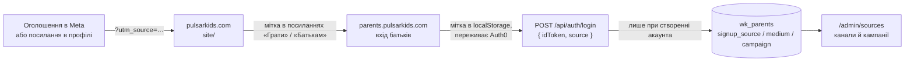

# Pulsar Kids: реклама і відстеження джерел

Станом на 2026-10-08.

Цей документ описує, як влаштована реклама Pulsar Kids: кому і де вона показується, з чого зібрана кампанія в Meta, звідки беруться картинки й відео, і як ми дізнаємося, який канал приводить батьків. Його варто прочитати перед тим, як запускати нову кампанію, додавати канал або міняти креативи.

## Підхід

- **Рекламу бачать батьки, а не діти.** Гра для дітей 4–10 років, але акаунт створює дорослий, і Meta не дозволяє показувати рекламу людям до 13 років. Тому вся аудиторія — батьки.
- **Реклама веде одразу на сайт.** Клік відкриває `pulsarkids.com`; проміжних профілів, форм чи месенджерів немає.
- **Успіх міряємо акаунтами, а не кліками.** Кожне посилання несе мітку каналу, а новий акаунт запам'ятовує, з якої мітки прийшов. В адмінці видно, скільки акаунтів дав канал і чи грають у них діти.
- **Починаємо з малого тесту.** Перша кампанія — 5 € на день на два дні, три оголошення в одному наборі: Meta сама показує те, що працює краще.
- **Один вигляд усюди.** Картинка, відео, обкладинка сторінки та лендінг зроблені в одному стилі (темно-фіолетове зоряне небо, фіолетова планета із замком), щоб людина після кліку впізнала сайт.

## Як це працює



## Акаунти Meta

| Що | Назва | Ідентифікатор |
|---|---|---|
| Портфоліо компанії | Yura Luchyshyn | `156333922280981` |
| Сторінка Facebook | Pulsar Kids (категорія «Освітній сайт») | `61595395073338` |
| Рекламний акаунт | Pulsar Kids — EUR, Europe/Warsaw | `1091499163581813` |
| Кампанія | Pulsar Kids — батьки, Україна — трафік | `120252883554860257` |
| Набір реклами | Батьки 27–45, Україна | `120252883554870257` |

Валюту й часовий пояс рекламного акаунта змінити не можна. Акаунта в Instagram немає: реклама показується там від імені сторінки Facebook (див. `TODO.md`).

Ads Manager: `https://adsmanager.facebook.com/adsmanager/manage/campaigns?act=1091499163581813&business_id=156333922280981`.

## Кампанія

| Рівень | Параметр | Значення |
|---|---|---|
| Кампанія | Ціль | Трафік |
| Набір | Куди веде | Сайт, `https://pulsarkids.com/` |
| Набір | Ціль результативності | Перегляди цільової сторінки |
| Набір | Бюджет | 5 € на день (до 8,75 € в окремий день) |
| Набір | Розклад | 8 жовтня 2026, 17:14 → 10 жовтня 2026, 17:14 |
| Набір | Розташування | 22 великі міста України (список нижче); Київ і Львів — лише саме місто, решта — місто + 40 км |
| Набір | Вік | 27–45 |
| Набір | Детальний таргетинг | Батьки дітей 3–5, 6–8 або 9–12 років (досить одного) |
| Набір | Аудиторія Advantage+ | Вимкнена — показ лише за критеріями вище |
| Набір | Місця розміщення | Автоматичні (Advantage+) |
| Набір | Правила вартості | Немає |

Оцінка розміру аудиторії від Meta — 96–113 тис. людей.

**Міста.** Київ, Львів, Харків, Одеса, Дніпро, Запоріжжя, Кривий Ріг, Миколаїв, Вінниця, Полтава, Чернігів, Черкаси, Хмельницький, Житомир, Суми, Рівне, Івано-Франківськ, Тернопіль, Луцьк, Чернівці, Кропивницький, Ужгород. Окупованих міст у списку немає; сіл теж, крім тих, що потрапляють у 40-кілометровий радіус довкола міста. Галочку «Охопіть більше людей…» під картою знято, інакше Meta показує рекламу й тим, хто лише цікавиться цими містами. Масове додавання міст у Meta ненадійне (на одну назву додає всі містечка області) — міста додаються по одному через пошук.

**Дата завершення календарна.** Вона не зсувається сама: якщо кампанію публікують пізніше, дати початку й кінця треба виставити заново («Бюджет і розклад» у наборі реклами).

**Правила вартості.** В акаунті збережено набір «Мобільна ОС і Розташування» (+50 % до ставки для iOS у восьми містах), але до набору реклами він не застосований: для малого тесту він лише здорожчує покази.

**Перед публікацією перевірити дату завершення.** Одного разу вона зникла сама (галочка «Установити дату завершення» виявилася знятою) — без неї кампанія списує гроші без кінця.

### Оголошення

У наборі три оголошення з однаковими текстами, посиланням і кнопкою «Докладніше»:

| Оголошення | Медіа | Ідентифікатор |
|---|---|---|
| Навчання у грі | Картинка 1200×630 | `120252883554880257` |
| Відео: заставка | 12 с; 9:16 для сторіз і Reels, 4:5 для стрічок | `120252884705930257` |
| Відео: всередині гри | 24,6 с; 9:16 для сторіз і Reels, 4:5 для стрічок | `120252884763170257` |

Тексти (Meta показує варіант, який працює краще):

- **Основний текст 1:** «Навчальні ігри для дітей 4–10 років: математика, логіка, мови, географія, астрономія. Без програшів і таймерів — дитина вчиться у власному темпі, а екранним часом керуєте ви.»
- **Основний текст 2:** «Дитина все одно бере до рук телефон — нехай цей час буде корисним. Pulsar Kids: короткі ігри з математики, логіки та мов українською, а скільки грати на день, вирішуєте ви.»
- **Заголовки:** «Pulsar Kids — навчальні ігри українською», «Екранний час, який навчає».
- **Опис:** «Для дітей 4–10 років».

Усе, що стверджує реклама, має бути правдою на сайті: вік 4–10, «45 ігор у дев'яти галактиках», «без реклами», «без програшів і таймерів». Коли на лендінгу міняються цифри, їх треба змінити і в креативах.

### Покращення Meta

- **В оголошенні з картинкою ввімкнено** «Додати музику». «Додати анімацію» теж вмикали, але після останньої заміни картинки її стан не перевірено — глянути перед публікацією.
- **Вимкнено всюди:** згенеровані ШІ зображення, «Накладення», «Ретуш», «Покращення тексту», «Покращення заклику до дії», деталі з каталогу.
- **Після заміни медіафайлу Meta скидає ці перемикачі** — їх треба перевіряти щоразу.
- **Розділ «Брендинг»:** задано лише фіолетовий колір `#7C3AED`. Поля «Тон тексту» й «Візуальний стиль» Meta зберегти не дала («Не вдалося зберегти»). Брендинг впливає тільки на ШІ-функції, які зараз вимкнені.

## Кампанії для Польщі та США (підготовлено 2026-10-10, ще не створені в Meta)

Гра тепер має англійську й польську мови, а на сайті та в рекламі з'явилась пробна гра без реєстрації. Звідси дві нові кампанії. Вони повторюють українську (ті самі акаунт, сторінка, стиль), але відрізняються трьома речами: **клік веде одразу в пробну гру**, головний креатив — **18-секундний ролик з геймплеєм і кнопкою «Грати»**, а показ іде **увечері в будні й цілий день у вихідні**.

### Що спільне для обох

| Параметр | Значення |
|---|---|
| Ціль кампанії | Трафік |
| Куди веде | Сайт; адреса — пробна гра: `https://play.pulsarkids.com/try?l=<код посилання>` |
| Ціль результативності | Перегляди цільової сторінки |
| Кнопка | «Грати» (Play Game); якщо Meta її не запропонує для цієї цілі — «Докладніше» |
| Вік | 27–45 |
| Детальний таргетинг | Батьки дітей 3–5, 6–8 або 9–12 років (досить одного) |
| Аудиторія Advantage+ | Вимкнена |
| Місця розміщення | Автоматичні (Advantage+) |
| Розклад показу | Пн–пт 17:00–22:00, сб–нд увесь день, **за часовим поясом глядача** |
| Бюджет | **На весь строк** (не денний): розклад за годинами Meta дозволяє лише з таким бюджетом |
| Параметри URL | `utm_source={{site_source_name}}&utm_medium=paid&utm_campaign=<parents-pl або parents-us>` |
| Покращення Meta | Як в українській кампанії: ШІ-зображення, накладення, ретуш, покращення тексту — вимкнено |

Мову пробної гри вибирає сама гра за країною відвідувача: у Польщі — польська, у США — англійська (`offeredLang`). Окремих адрес для мов не потрібно.

**Посилання.** На кожне оголошення — своє посилання з адмінки (`/admin/links`, режим «Одразу в пробну гру»), щоб бачити не лише кліки, а й скільки пробних ігор почато, дограно до кінця, скільки разів натиснуто «Створити акаунт» і скільки акаунтів створено:

| Оголошення | Код для Польщі | Код для США |
|---|---|---|
| Відео «Грати» (18 с) | `meta-pl-play` | `meta-us-play` |
| Відео: заставка (12 с) | `meta-pl-intro` | `meta-us-intro` |
| Картинка | `meta-pl-image` | `meta-us-image` |

Посилання треба створити **до** запуску: перехід за кодом, якого немає в базі, зарахується як пробна гра «без посилання».

### Польща

| Параметр | Значення |
|---|---|
| Назва кампанії | Pulsar Kids — rodzice, Polska — gra próbna |
| Розташування | Уся Польща (країна цілком), лише люди, які там живуть |
| Мова аудиторії | Польська |
| Запропонований бюджет | 70 € на 7 днів (≈10 € на день) |

Мова аудиторії задана навмисно: без неї реклама польською піде й українцям у Польщі, для яких є українська кампанія з іншими текстами.

Тексти:

- **Основний текст 1:** «Gry edukacyjne dla dzieci w wieku 4–10 lat: matematyka, logika, język, geografia, astronomia. Bez przegranych i bez stoperów — dziecko uczy się we własnym tempie, a czas przed ekranem ustalasz Ty. Wypróbuj demo za darmo, bez rejestracji.»
- **Основний текст 2:** «Dziecko i tak sięgnie po telefon — niech te 20 minut będzie pożyteczne. Pulsar Kids: 52 krótkie gry edukacyjne po polsku, bez reklam. Kliknij „Graj” i wypróbuj demo od razu, za darmo.»
- **Заголовки:** «Czas przed ekranem, który uczy», «Wypróbuj demo za darmo — bez rejestracji».
- **Опис:** «Dla dzieci w wieku 4–10 lat».

### США

| Параметр | Значення |
|---|---|
| Назва кампанії | Pulsar Kids — parents, US cities — free demo |
| Розташування | 12 міст зі списку нижче, кожне — місто + 25 миль (40 км); лише люди, які там живуть |
| Мова аудиторії | Англійська (усі варіанти) |
| Запропонований бюджет | 140 € на 7 днів (≈20 € на день) |

**Міста:** Х'юстон, Даллас — Форт-Верт, Сан-Антоніо, Остін (Техас); Фінікс (Аризона); Солт-Лейк-Сіті разом із Прово (Юта); Атланта (Джорджія); Шарлотт, Ралі — Дарем (Північна Кароліна); Орландо, Тампа (Флорида); Колумбус (Огайо).

Чому ці, а не найбільші:

- **Багато сімей із дітьми 4–10 років.** Це міста «сонячного поясу» і Середнього Заходу, які ростуть саме за рахунок молодих сімей; у Юті найбільша в країні частка дітей у населенні.
- **Покази дешевші.** У Нью-Йорку, Лос-Анджелесі, Сан-Франциско, Бостоні, Сіетлі аукціон найдорожчий у країні — на малий бюджет там мало що встигнеш побачити.
- **Передмістя.** Радіус 25 миль захоплює передмістя, де й живуть сім'ї; саме тому місто береться з радіусом, а не «лише місто».
- **Домашнє навчання.** Техас, Флорида, Північна Кароліна, Аризона, Юта — штати, де найбільше родин навчає дітей удома і шукає навчальні ігри.

Покази у США в кілька разів дорожчі, ніж в Україні й Польщі, тому бюджет тут удвічі більший, а міст небагато: краще 12 міст із відчутною кількістю показів, ніж уся країна потроху. Після тижня — лишити 4–5 міст із найдешевшим почином пробної гри.

Запасна ідея для США — окремий набір на українську та польську діаспору (Чикаго, Нью-Йорк із Нью-Джерсі, Філадельфія, Сакраменто, Сіетл, Клівленд, Детройт; аудиторія — за мовою). Там Pulsar Kids має те, чого немає у великих американських конкурентів: гру рідною мовою дитини. Для цього в «Доступності» не можна обмежувати США самою англійською.

Тексти:

- **Основний текст 1:** «Learning games for kids aged 4–10: math, logic, language, geography, astronomy. No losing and no timers — your child learns at their own pace, and you set the screen time. Try the demo free, no sign-up.»
- **Основний текст 2:** «They're going to pick up the phone anyway — make those 20 minutes count. Pulsar Kids: 50 short learning games, no ads. Tap Play and try the demo right now, for free.»
- **Заголовки:** «Screen time that teaches», «Try the free demo — no sign-up».
- **Опис:** «For kids aged 4–10».

### Ролик «Грати» (18 с)

Зроблений за посекундним сценарієм:

| Час | Що на екрані | Текст (uk / en / pl) |
|---|---|---|
| 0–3 с | Зачіпка: дівчинка з телефоном (емодзі), великий заголовок | «Займіть дитину з користю на 20 хвилин!» / «Keep your child busy — and learning — for 20 minutes!» / «Zajmij dziecko mądrze na 20 minut!» |
| 3–14 с | Нарізка справжнього геймплею чотирьох ігор у рамці телефона: прапори, додавання, дзеркало, візерунки | Три плашки: «Безкоштовна проба · Українською · Без реклами» / «Free to try · In English · No ads» / «Za darmo na próbę · Po polsku · Bez reklam» |
| 14–18 с | Жовта кнопка «Грати», палець натискає її | «Тицяйте „Грати“ та спробуйте демо безкоштовно!» / «Tap “Play” and try the demo for free!» / «Kliknij „Graj” i wypróbuj demo za darmo!» |

- **Живого обличчя дитини в ролику немає** — його замінює емодзі. Справжнє 3-секундне відео дитини з планшетом на початку майже напевно спрацює краще; його треба зняти самим (або купити на стоку з дозволом на рекламу) і поставити перед роликом.
- **Звуку й голосу немає**, як і в учорашніх відео: більшість дивиться стрічку без звуку, тому весь зміст — у тексті на екрані. Музику можна додати в Ads Manager («Додати музику»).
- **«Безкоштовно»** в рекламі сказано про пробну гру. Якщо гра стане платною, тексти міняти не доведеться; якщо пробну гру приберуть — доведеться.

### Піксель Meta і подія «Початок гри»

Порада оптимізувати рекламу під подію «Початок гри» слушна, але пікселя на сайті й у грі немає, і ставити його в саму гру **не варто без окремого рішення**: у гру грає дитина, а піксель збирає ідентифікатори для рекламного профілю. У США це підпадає під закон COPPA (потрібна перевірена згода батьків), у Польщі — під GDPR (потрібна згода на cookies, банера згоди на сайті немає).

Що є натомість уже зараз: подію «пробну гру почато» рахує наша база (`wk_visits`) — для кожного посилання окремо, без жодних сторонніх трекерів. Meta оптимізує покази під перегляд сторінки пробної гри, а ми в `/admin/links` бачимо, яке оголошення дає справжні початі ігри й акаунти, і вимикаємо слабкі вручну. На малих бюджетах це мало відрізняється від оптимізації пікселем: Meta потребує близько 50 подій на тиждень на набір, щоб алгоритм навчився.

Якщо піксель усе ж потрібен, безпечніший варіант — поставити його лише на сайт для батьків (подія на кнопці «Спробувати гру зараз») разом із банером згоди, а рекламу вести на сайт, а не одразу в гру.

### Що потрібно, щоб кампанії з'явилися в Meta

1. Задеплоїти гру й сайт: пробної гри та `/admin/links` у продакшені ще немає.
2. Створити в `/admin/links` шість посилань із таблиці вище.
3. Зібрати дві кампанії в Ads Manager за цими таблицями (у цій сесії доступу до Ads Manager немає: ні розширення браузера, ні токена Marketing API в `scripts/ads/.env`).
4. Перед публікацією — перевірити дату завершення й перемикачі покращень, як описано в «Як запустити й зупинити».

## Креативи

Готові файли лежать у `scripts/ads/`, вихідники — у `scripts/ads/creative/`.

| Файл | Що це | Де використано |
|---|---|---|
| `pulsar-kids-space.png` | Картинка 1200×630 | Оголошення «Навчання у грі»; та сама, що `app/public/og-image.png` |
| `pulsar-kids-ad.mp4`, `pulsar-kids-ad-4x5.mp4` | Заставка, 12 с | Оголошення «Відео: заставка» |
| `pulsar-kids-inside.mp4`, `pulsar-kids-inside-4x5.mp4` | Запис гри в рамці телефона, 24,6 с | Оголошення «Відео: всередині гри» |
| `pulsar-kids-cover.png` | Обкладинка 1640×624 | Сторінка Facebook |
| `pulsar-kids-space-en.png`, `-pl.png` | Картинка 1200×630 англійською та польською | Кампанії для США й Польщі |
| `pulsar-kids-ad-en.mp4`, `-pl.mp4` (і `-4x5`) | Заставка, 12 с, англійською та польською | Кампанії для США й Польщі |
| `pulsar-kids-play-en.mp4`, `-pl.mp4` (і `-4x5`) | Ролик «Грати», 18 с: зачіпка, нарізка ігор, кнопка | Кампанії для США й Польщі |
| `pulsar-kids-avatar.png` | Аватарка 720×720 (знак із `app/public/favicon.svg`) | Сторінка Facebook |

Як це зроблено:

- **Стиль** — `space.css` (небо, планета) і `space.js` (зірки, жителі планети). Його ж палітру має сайт (`app/site/src/styles`).
- **Тексти** — `texts.js`: слова всіх картинок і відео трьома мовами; мову сторінки задає `?lang=en` або `?lang=pl` (без параметра — українська). Числа ігор там мають збігатися з лендінгом цієї мови (50 / 50 / 52).
- **Сторінки** — `play.html` (ролик «Грати»; нарізку ігор для нього записує `recording/cuts.mjs`), `og.html` (картинка; з `?cover` — обкладинка), `intro.html` (заставка), `inside.html` (запис у телефоні з підписами). Відео мають параметр `?h=1350` для версії 4:5.
- **Рендер** — `render.mjs` відкриває сторінку в headless Chromium (той, що ставить Playwright) і знімає картинку або кадри по одному; `encode.swift` збирає кадри в mp4 (H.264, 30 кадрів/с, без звуку).
- **Запис гри** — `recording/record.mjs` проходить справжній застосунок на локальному dev-сервері. Усі запити до `/api` підмінюються в браузері вигаданим профілем дитини, тож база не зачіпається.

Перегенерувати (з `scripts/ads/creative/`):

```bash
node render.mjs og.html 1200 630 ../pulsar-kids-space.png
node render.mjs 'og.html?cover' 1640 624 ../pulsar-kids-cover.png

node render.mjs intro.html 1080 1920 /tmp/intro 12000 && swift encode.swift /tmp/intro ../pulsar-kids-ad.mp4 30
node render.mjs 'intro.html?h=1350' 1080 1350 /tmp/intro45 12000 && swift encode.swift /tmp/intro45 ../pulsar-kids-ad-4x5.mp4 30
```

Іншою мовою — те саме з `?lang=en` або `?lang=pl` (`'og.html?lang=pl'`, `'intro.html?lang=en&h=1350'`).

Ролик «Грати»: запустити гру (`cd app/game && npx vite --port 4399 --host 127.0.0.1`), записати нарізку мовою ролика і відрендерити (числа кадрів — із `cuts.json`):

```bash
. recording/tips.env && AD_LANG=en node recording/cuts.mjs /tmp/cuts-en geography:flags:2 math:add:3 logic:mirror:3 logic:patterns:3
node render.mjs 'play.html?lang=en&cuts=/tmp/cuts-en&counts=127,126,127,127' 1080 1920 /tmp/play-en 18000 && swift encode.swift /tmp/play-en ../pulsar-kids-play-en.mp4 30
```

Рендери запускати **по одному**: два одночасні можуть під'єднатися до одного браузера й зіпсувати кадри одне одному.

Для відео «всередині гри» спершу потрібен запис: запустити застосунок (`npx vite --port 4399`), виконати `. recording/tips.env && node recording/record.mjs /tmp/frames`, а тоді відрендерити `inside.html` з параметрами `frames`, `count`, `speed`, `cues` (описані в самому файлі).

Обмеження: файл для завантаження через браузерне розширення має бути до 10 МБ; тому бітрейт у `encode.swift` — 3 Мбіт/с.

## Мітки каналів

| Канал | Що ставити |
|---|---|
| Реклама в Meta (поле «Параметри URL-адреси» в оголошенні) | `utm_source={{site_source_name}}&utm_medium=paid&utm_campaign=parents-ua` |
| Сторінка й дописи у Facebook | `https://pulsarkids.com/?utm_source=facebook&utm_medium=social` |
| Профіль і сторіз в Instagram | `https://pulsarkids.com/?utm_source=instagram&utm_medium=social` |
| Опис каналу й відео на YouTube | `https://pulsarkids.com/?utm_source=youtube&utm_medium=video` |
| Профіль у TikTok | `https://pulsarkids.com/?utm_source=tiktok&utm_medium=social` |

- У рекламі Meta сама підставляє `fb`, `ig`, `msg` або `an` — де саме показали оголошення.
- Для нової кампанії міняється лише `utm_campaign`: малі латинські літери, цифри, дефіс.
- Мітка — це до 60 знаків із набору `a-z 0-9 . _ -`; інше сервер відкидає (`api/_lib/source.js`).
- Ті самі посилання з кнопкою «Копіювати» є на сторінці `/admin/sources`.

## Власні посилання і пробна гра

Крім міток `utm_*`, в адмінці (`/admin/links`) можна створити власне посилання — на кожне місце, де його поставиш (допис, біо, оголошення, QR-код). У посилання є код, який їде в адресі як `?l=<код>`, і режим — куди воно веде:

| Режим | Адреса |
| --- | --- |
| На сайт | `https://pulsarkids.com/?l=<код>` |
| Одразу в пробну гру | `https://play.pulsarkids.com/try?l=<код>` |

Кожен перехід записується в базу (`wk_visits`): коли, за яким посиланням, у який режим, з якої країни, якою мовою, з якого пристрою. На сторінці `/admin/links` це можна фільтрувати, групувати й сортувати; там само видно, скільки пробних ігор дограли до кінця, скільки разів натиснули «Створити акаунт» і скільки акаунтів зрештою створено за посиланням. До такого посилання можна дописати й мітки `utm_*`.

Пробна гра (`/try`) — це справжня гра без акаунта на кілька хвилин (тривалість — у `/admin/settings`, за замовчуванням 5). Нічого з набраного не зберігається; коли час спливає, дитину просять покликати батьків, щоб ті створили акаунт. На сайті в неї веде кнопка «Спробувати гру зараз».

## Як зберігається джерело

1. **Сайт** (`site/src/scripts/portals.ts`): бере `utm_*` з адреси, а якщо їх немає — сайт, з якого прийшла людина (`document.referrer`, тип `referral`). Зберігає в `localStorage` під ключем `pulsar-source-v1` і дописує до всіх посилань `[data-portal]`.
2. **Застосунок** (`src/core/app/attribution.ts`): `rememberSource()` викликається в `main.tsx` до того, як аналітика обріже параметри з адреси; мітка лягає в `localStorage` і переживає перехід на Auth0 і назад.
3. **Вхід** (`useAuthStore` → `api.auth0Login` / `api.login`): мітка йде в тілі `POST /api/auth/login` як `source`.
4. **Сервер** (`api/auth/login.js`, `createParent` у `api/_lib/db.js`): зберігає мітку в `wk_parents.signup_source`, `signup_medium`, `signup_campaign` — **лише коли цей вхід створює акаунт**. Існуючий акаунт джерела не міняє.

Що з цього випливає:

- Акаунти, створені до 8 жовтня 2026, джерела не мають.
- Якщо людина побачила рекламу на телефоні, а зареєструвалася з іншого пристрою чи браузера, джерело губиться.
- Фіксується останнє джерело перед реєстрацією в цьому браузері, а не перше.
- Пікселя Meta на сайті немає, тож Meta бачить кліки й перегляди сторінки, але не реєстрації. Зв'язок «оголошення → акаунт» є лише в нашій адмінці.

## Панель «Джерела»

`/admin/sources` (`src/pages/admin/SourcesPage.tsx`), кнопка «📊 Джерела» на головній сторінці адмінки. Окремого запиту немає: сторінка рахує все в браузері зі списку акаунтів (`GET /api/admin/users`).

- **Канали:** акаунтів, частка, скільки з дітьми, скільки дітей грали, виконано завдань.
- **Кампанії:** те саме для «канал · тип переходу · кампанія».
- **Період:** 7 днів, 30 днів, весь час — за датою створення акаунта.
- `channelOf()` зводить в один канал коди Meta (`fb` → Facebook, `ig` → Instagram) та хости-посередники (`l.facebook.com` тощо).

Перегляди самого лендінгу з розбивкою за джерелом — у Vercel Web Analytics.

## Як запустити й зупинити

1. В Ads Manager перевірити дати в наборі реклами та перемикачі покращень в оголошеннях.
2. Підтвердити дані рекламного акаунта («Огляд облікового запису») і додати спосіб оплати — це робить власник акаунта.
3. «Перевірка й публікація» → «Опублікувати».
4. Зупинити раніше: вимкнути перемикач кампанії. Без дати завершення кампанія списує гроші, доки її не вимкнуть.
5. Через 2–3 дні порівняти: витрати й кліки в Ads Manager, нові акаунти — у `/admin/sources`.

## Marketing API

`scripts/ads/meta-ads.mjs` уміє створювати кампанії з `scripts/ads/campaigns.json` через Meta Marketing API (`check`, `search`, `plan`, `create`, `launch`, `pause`, `stats`). Поточну кампанію зібрано вручну в Ads Manager, і скрипт для неї не використовувався: на справжньому API він не перевірений, бо токена немає. Він знадобиться, якщо кампаній стане багато. Потрібні для нього змінні описані в `docs/external-services.md`.

## Відоме й відкладене

- **Instagram-акаунт** — на потім (`TODO.md`).
- **Meta попереджає про розширення браузера.** Під час завантаження медіа через розширення Claude Ads Manager показав «Несправне розширення браузера». Зміни збереглися, але великі правки надійніше робити вручну.
- **Горизонтальних версій відео немає** — для місць розміщення 16:9 Meta обрізає відео сама або не показує його.
- **Друге відео довше за рекомендовані 15 секунд.** Англійською й польською його не робили: його місце зайняв ролик «Грати» з нарізкою ігор.
- **В українській заставці написано «45 ігор»,** а ігор уже 50. У вихідниках (`texts.js`) число виправлено; саме відео в Meta треба перерендерити й замінити.
- **Після аватарки на сторінці з'явився допис** «Pulsar Kids оновлює свою основну світлину» — так Facebook робить завжди.
