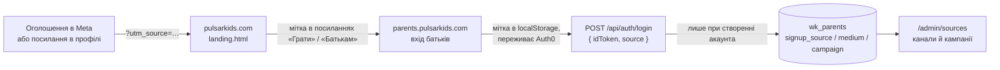

# Pulsar Kids: реклама і відстеження джерел

Станом на 2026-10-08.

Цей документ описує, як влаштована реклама Pulsar Kids: кому і де вона показується, з чого зібрана кампанія в Meta, звідки беруться картинки й відео, і як ми дізнаємося, який канал приводить батьків. Його варто прочитати перед тим, як запускати нову кампанію, додавати канал або міняти креативи.

## Підхід

- **Рекламу бачать батьки, а не діти.** Гра для дітей 4–10 років, але акаунт створює дорослий, і Meta не дозволяє показувати рекламу людям до 13 років. Тому вся аудиторія — батьки.
- **Реклама веде одразу на сайт.** Клік відкриває `pulsarkids.com`; проміжних профілів, форм чи месенджерів немає.
- **Успіх міряємо акаунтами, а не кліками.** Кожне посилання несе мітку каналу, а новий акаунт запам'ятовує, з якої мітки прийшов. В адмінці видно, скільки акаунтів дав канал і чи грають у них діти.
- **Починаємо з малого тесту.** Перша кампанія — 5 € на день на два дні, три оголошення в одному наборі: Meta сама показує те, що працює краще.
- **Один вигляд усюди.** Картинка, відео, обкладинка сторінки та лендінг зроблені в одному стилі (темно-фіолетове зоряне небо, фіолетова планета із замком), щоб людина після кліку впізнала сайт.

## Як це працює



## Акаунти Meta

| Що | Назва | Ідентифікатор |
|---|---|---|
| Портфоліо компанії | Yura Luchyshyn | `156333922280981` |
| Сторінка Facebook | Pulsar Kids (категорія «Освітній сайт») | `61595395073338` |
| Рекламний акаунт | Pulsar Kids — EUR, Europe/Warsaw | `1091499163581813` |
| Кампанія | Pulsar Kids — батьки, Україна — трафік | `120252883554860257` |
| Набір реклами | Батьки 27–45, Україна | `120252883554870257` |

Валюту й часовий пояс рекламного акаунта змінити не можна. Акаунта в Instagram немає: реклама показується там від імені сторінки Facebook (див. `TODO.md`).

Ads Manager: `https://adsmanager.facebook.com/adsmanager/manage/campaigns?act=1091499163581813&business_id=156333922280981`.

## Кампанія

| Рівень | Параметр | Значення |
|---|---|---|
| Кампанія | Ціль | Трафік |
| Набір | Куди веде | Сайт, `https://pulsarkids.com/` |
| Набір | Ціль результативності | Перегляди цільової сторінки |
| Набір | Бюджет | 5 € на день (до 8,75 € в окремий день) |
| Набір | Розклад | 8 жовтня 2026, 17:14 → 10 жовтня 2026, 17:14 |
| Набір | Країна | Україна |
| Набір | Вік | 27–45 |
| Набір | Детальний таргетинг | Батьки дітей 3–5, 6–8 або 9–12 років (досить одного) |
| Набір | Аудиторія Advantage+ | Вимкнена — показ лише за критеріями вище |
| Набір | Місця розміщення | Автоматичні (Advantage+) |
| Набір | Правила вартості | Набір «Мобільна ОС і Розташування» — див. нижче |

Оцінка розміру аудиторії від Meta — 115–135 тис. людей.

**Дата завершення календарна.** Вона не зсувається сама: якщо кампанію публікують пізніше, дати початку й кінця треба виставити заново («Бюджет і розклад» у наборі реклами).

**Правила вартості.** Обраний набір підвищує ставку на 50 % для людей з iOS у восьми містах (Львів, Тернопіль, Київ, Івано-Франківськ, Ужгород, Вінниця, Харків, Одеса). Це свідомий вибір власника; для тесту на 10 € він звужує покази до дорожчої частини аудиторії.

### Оголошення

У наборі три оголошення з однаковими текстами, посиланням і кнопкою «Докладніше»:

| Оголошення | Медіа | Ідентифікатор |
|---|---|---|
| Навчання у грі | Картинка 1200×630 | `120252883554880257` |
| Відео: заставка | 12 с; 9:16 для сторіз і Reels, 4:5 для стрічок | `120252884705930257` |
| Відео: всередині гри | 24,6 с; 9:16 для сторіз і Reels, 4:5 для стрічок | `120252884763170257` |

Тексти (Meta показує варіант, який працює краще):

- **Основний текст 1:** «Навчальні ігри для дітей 4–10 років: математика, логіка, мови, географія, астрономія. Без програшів і таймерів — дитина вчиться у власному темпі, а екранним часом керуєте ви.»
- **Основний текст 2:** «Дитина все одно бере до рук телефон — нехай цей час буде корисним. Pulsar Kids: короткі ігри з математики, логіки та мов українською, а скільки грати на день, вирішуєте ви.»
- **Заголовки:** «Pulsar Kids — навчальні ігри українською», «Екранний час, який навчає».
- **Опис:** «Для дітей 4–10 років».

Усе, що стверджує реклама, має бути правдою на сайті: вік 4–10, «45 ігор у дев'яти галактиках», «без реклами», «без програшів і таймерів». Коли на лендінгу міняються цифри, їх треба змінити і в креативах.

### Покращення Meta

- **В оголошенні з картинкою ввімкнено** «Додати музику». «Додати анімацію» теж вмикали, але після останньої заміни картинки її стан не перевірено — глянути перед публікацією.
- **Вимкнено всюди:** згенеровані ШІ зображення, «Накладення», «Ретуш», «Покращення тексту», «Покращення заклику до дії», деталі з каталогу.
- **Після заміни медіафайлу Meta скидає ці перемикачі** — їх треба перевіряти щоразу.
- **Розділ «Брендинг»:** задано лише фіолетовий колір `#7C3AED`. Поля «Тон тексту» й «Візуальний стиль» Meta зберегти не дала («Не вдалося зберегти»). Брендинг впливає тільки на ШІ-функції, які зараз вимкнені.

## Креативи

Готові файли лежать у `scripts/ads/`, вихідники — у `scripts/ads/creative/`.

| Файл | Що це | Де використано |
|---|---|---|
| `pulsar-kids-space.png` | Картинка 1200×630 | Оголошення «Навчання у грі»; та сама, що `app/public/og-image.png` |
| `pulsar-kids-ad.mp4`, `pulsar-kids-ad-4x5.mp4` | Заставка, 12 с | Оголошення «Відео: заставка» |
| `pulsar-kids-inside.mp4`, `pulsar-kids-inside-4x5.mp4` | Запис гри в рамці телефона, 24,6 с | Оголошення «Відео: всередині гри» |
| `pulsar-kids-cover.png` | Обкладинка 1640×624 | Сторінка Facebook |
| `pulsar-kids-avatar.png` | Аватарка 720×720 (знак із `app/public/favicon.svg`) | Сторінка Facebook |

Як це зроблено:

- **Стиль** — `space.css` (небо, планета) і `space.js` (зірки, жителі планети). Його ж палітру має лендінг (`app/landing.html`).
- **Сторінки** — `og.html` (картинка; з `?cover` — обкладинка), `intro.html` (заставка), `inside.html` (запис у телефоні з підписами). Відео мають параметр `?h=1350` для версії 4:5.
- **Рендер** — `render.mjs` відкриває сторінку в headless Chromium (той, що ставить Playwright) і знімає картинку або кадри по одному; `encode.swift` збирає кадри в mp4 (H.264, 30 кадрів/с, без звуку).
- **Запис гри** — `recording/record.mjs` проходить справжній застосунок на локальному dev-сервері. Усі запити до `/api` підмінюються в браузері вигаданим профілем дитини, тож база не зачіпається.

Перегенерувати (з `scripts/ads/creative/`):

```bash
node render.mjs og.html 1200 630 ../pulsar-kids-space.png
node render.mjs 'og.html?cover' 1640 624 ../pulsar-kids-cover.png

node render.mjs intro.html 1080 1920 /tmp/intro 12000 && swift encode.swift /tmp/intro ../pulsar-kids-ad.mp4 30
node render.mjs 'intro.html?h=1350' 1080 1350 /tmp/intro45 12000 && swift encode.swift /tmp/intro45 ../pulsar-kids-ad-4x5.mp4 30
```

Для відео «всередині гри» спершу потрібен запис: запустити застосунок (`npx vite --port 4399`), виконати `. recording/tips.env && node recording/record.mjs /tmp/frames`, а тоді відрендерити `inside.html` з параметрами `frames`, `count`, `speed`, `cues` (описані в самому файлі).

Обмеження: файл для завантаження через браузерне розширення має бути до 10 МБ; тому бітрейт у `encode.swift` — 3 Мбіт/с.

## Мітки каналів

| Канал | Що ставити |
|---|---|
| Реклама в Meta (поле «Параметри URL-адреси» в оголошенні) | `utm_source={{site_source_name}}&utm_medium=paid&utm_campaign=parents-ua` |
| Сторінка й дописи у Facebook | `https://pulsarkids.com/?utm_source=facebook&utm_medium=social` |
| Профіль і сторіз в Instagram | `https://pulsarkids.com/?utm_source=instagram&utm_medium=social` |
| Опис каналу й відео на YouTube | `https://pulsarkids.com/?utm_source=youtube&utm_medium=video` |
| Профіль у TikTok | `https://pulsarkids.com/?utm_source=tiktok&utm_medium=social` |

- У рекламі Meta сама підставляє `fb`, `ig`, `msg` або `an` — де саме показали оголошення.
- Для нової кампанії міняється лише `utm_campaign`: малі латинські літери, цифри, дефіс.
- Мітка — це до 60 знаків із набору `a-z 0-9 . _ -`; інше сервер відкидає (`api/_lib/source.js`).
- Ті самі посилання з кнопкою «Копіювати» є на сторінці `/admin/sources`.

## Як зберігається джерело

1. **Лендінг** (`landing.html`, останній скрипт): бере `utm_*` з адреси, а якщо їх немає — сайт, з якого прийшла людина (`document.referrer`, тип `referral`). Зберігає в `localStorage` під ключем `pulsar-source-v1` і дописує до всіх посилань `[data-portal]`.
2. **Застосунок** (`src/core/app/attribution.ts`): `rememberSource()` викликається в `main.tsx` до того, як аналітика обріже параметри з адреси; мітка лягає в `localStorage` і переживає перехід на Auth0 і назад.
3. **Вхід** (`useAuthStore` → `api.auth0Login` / `api.login`): мітка йде в тілі `POST /api/auth/login` як `source`.
4. **Сервер** (`api/auth/login.js`, `createParent` у `api/_lib/db.js`): зберігає мітку в `wk_parents.signup_source`, `signup_medium`, `signup_campaign` — **лише коли цей вхід створює акаунт**. Існуючий акаунт джерела не міняє.

Що з цього випливає:

- Акаунти, створені до 8 жовтня 2026, джерела не мають.
- Якщо людина побачила рекламу на телефоні, а зареєструвалася з іншого пристрою чи браузера, джерело губиться.
- Фіксується останнє джерело перед реєстрацією в цьому браузері, а не перше.
- Пікселя Meta на сайті немає, тож Meta бачить кліки й перегляди сторінки, але не реєстрації. Зв'язок «оголошення → акаунт» є лише в нашій адмінці.

## Панель «Джерела»

`/admin/sources` (`src/pages/admin/SourcesPage.tsx`), кнопка «📊 Джерела» на головній сторінці адмінки. Окремого запиту немає: сторінка рахує все в браузері зі списку акаунтів (`GET /api/admin/users`).

- **Канали:** акаунтів, частка, скільки з дітьми, скільки дітей грали, виконано завдань.
- **Кампанії:** те саме для «канал · тип переходу · кампанія».
- **Період:** 7 днів, 30 днів, весь час — за датою створення акаунта.
- `channelOf()` зводить в один канал коди Meta (`fb` → Facebook, `ig` → Instagram) та хости-посередники (`l.facebook.com` тощо).

Перегляди самого лендінгу з розбивкою за джерелом — у Vercel Web Analytics.

## Як запустити й зупинити

1. В Ads Manager перевірити дати в наборі реклами та перемикачі покращень в оголошеннях.
2. Підтвердити дані рекламного акаунта («Огляд облікового запису») і додати спосіб оплати — це робить власник акаунта.
3. «Перевірка й публікація» → «Опублікувати».
4. Зупинити раніше: вимкнути перемикач кампанії. Без дати завершення кампанія списує гроші, доки її не вимкнуть.
5. Через 2–3 дні порівняти: витрати й кліки в Ads Manager, нові акаунти — у `/admin/sources`.

## Marketing API

`scripts/ads/meta-ads.mjs` уміє створювати кампанії з `scripts/ads/campaigns.json` через Meta Marketing API (`check`, `search`, `plan`, `create`, `launch`, `pause`, `stats`). Поточну кампанію зібрано вручну в Ads Manager, і скрипт для неї не використовувався: на справжньому API він не перевірений, бо токена немає. Він знадобиться, якщо кампаній стане багато. Потрібні для нього змінні описані в `docs/external-services.md`.

## Відоме й відкладене

- **Instagram-акаунт** — на потім (`TODO.md`).
- **Meta попереджає про розширення браузера.** Під час завантаження медіа через розширення Claude Ads Manager показав «Несправне розширення браузера». Зміни збереглися, але великі правки надійніше робити вручну.
- **Горизонтальних версій відео немає** — для місць розміщення 16:9 Meta обрізає відео сама або не показує його.
- **Друге відео довше за рекомендовані 15 секунд.**
- **Після аватарки на сторінці з'явився допис** «Pulsar Kids оновлює свою основну світлину» — так Facebook робить завжди.
